# bikesharing

We used Citi Bike data that has been released to the public for your analysis. This data was for New York City. We were asked to analyze the New York data to see if such a bike share business is feasible for Des Moines, Iowa.

Technologies Used:
- Tableau Public
- Python
- Jupyter Notebook
- Pandas

The entire Tableau Public project is available here:

https://public.tableau.com/app/profile/bruce.jilek/viz/Module14_Deliverables_2_and_3/VIZ_1CheckoutTimesforUsers

There are selectable pages in the project, which can be chosen via the dropdown icon in the upper-left. Note that there are worksheet visualizations (VIZ), a dashboard (DASHBOARD), and a story (STORY).

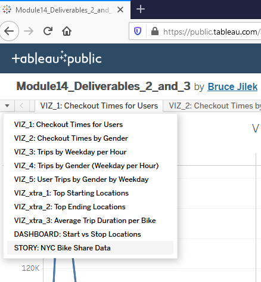

## Overview

The data for the bike sharing analysis came from:

https://www.citibikenyc.com/system-data

Specifically, we used the ride sharing data for Aug. 2019, which clicks through to this URL:

https://s3.amazonaws.com/tripdata/201908-citibike-tripdata.csv.zip

The main purpose of this module was to learn how to use Tableau to create visualizations inside individual worksheets, and then pull those worksheets into Tableau 'dashboards' and 'stories'.

As a secondary goal, we also used Python and Pandas to convert one column of the CSV file into a Pandas 'datetime' datatype, so that we could analyze trip durations in hours and minutes.

## Results

The following images show the progress of the work. Figures 1 through 5 were created for Deliverable 1. Figures 6 through 8 were created as extra images to be used for

#### Deliverable 1: Change Trip duration to a Datetime Format

Jupyter Notebook and Python were used to read the CSV file for the bike share data (201908-citibike-tripdata.csv) into a Pandas DataFrame. Then the 'tripduration' columns was transformed from 'int64' to 'datetime64', and then the modified DataFrame was saved to 'bike_df.csv' (without an index column).

The Jupyter Notebook is available as 'NYC_Citibike_Challenge.ipynb' in my GitHub repo:

https://github.com/jilek/bikesharing

https://github.com/jilek/bikesharing/blob/main/NYC_Citibike_Challenge.ipynb

#### Deliverable 2: Create Visualizations for the Trip Analysis

###### Checkout time for users.

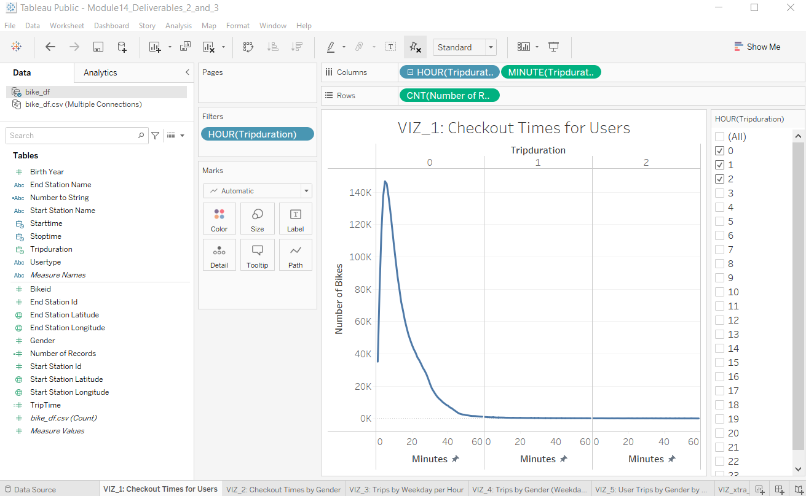

Figure 1. Checkout times for users.

The visualization in Figure 1 above shows the trip duration in minutes per hour, for any of the hours selected in the 'HOUR(Tripduration)' filter shown to the right of the chart. The typical rental peaks at around 10 minutes, and nearly all the rides are under one hour in duration.

###### Checkout times by gender.

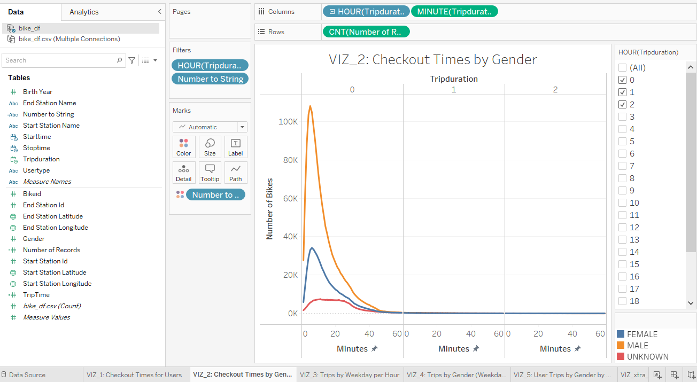

Figure 2. Checkout times by gender.

The visualization in Figure 2 above shows the same data as in Figure 1, but is broken down by gender, and with a filter to select which genders should be displayed. The data clearly shows that the primary bike riders are male.

###### Trips by gender per weekday per hour.

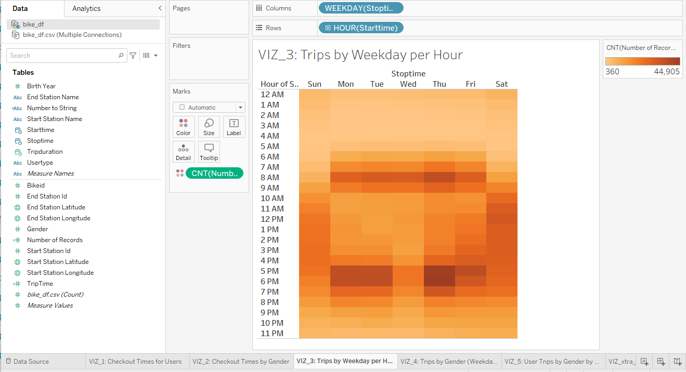

Figure 3. Trips by Weekday per Hour.

The heatmap visualization in Figure 3 above shows that the primary bike trips are between 6am and 10am Monday through Friday, with secondary usage between 10am and 8pm on Saturday and Sunday.

###### Trips by gender (weekday per hour).

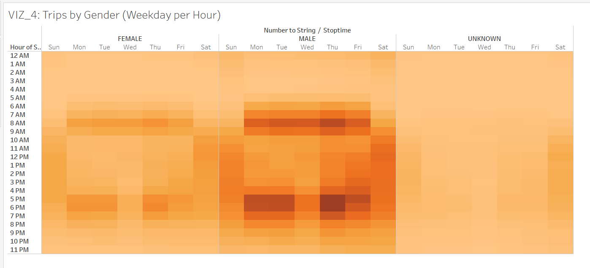

Figure 4. Trips by gender_Weekday per Hour.

The heatmap in Figure 4 shows the same thing as Figure 3, but reinforces that the primary riders are male.

###### User trips by gender by weekday.

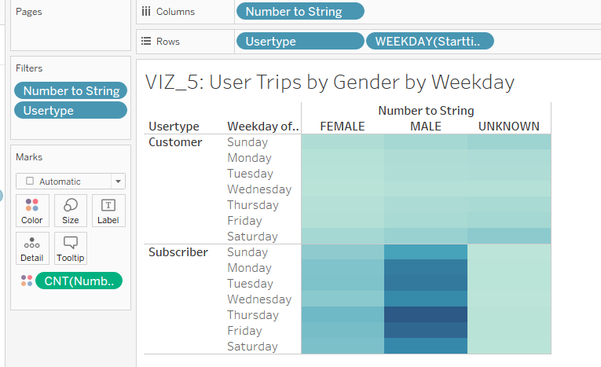

Figure 5. User trips by gender by weekday.

The visualization in Figure 5 above shows that in addition to being male, the primary riders are subscribers to the service (instead of per-use customers).

#### Deliverable 3, Part 1: Create extra visualizations

###### Extra visualization: Top starting locations.

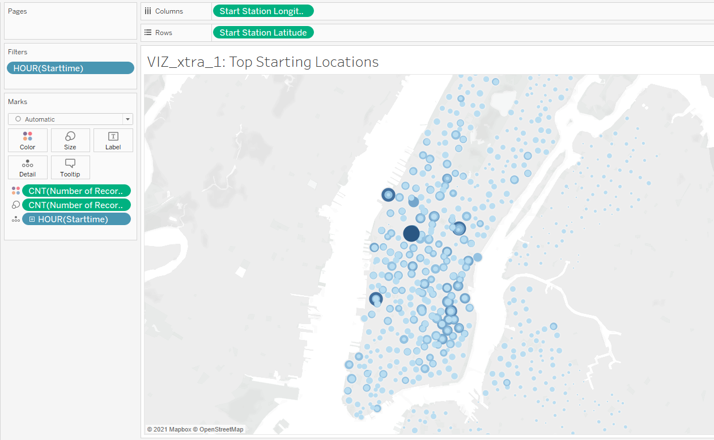

Figure 6. Top starting locations.

The bubble map in Figure 6 above shows the top starting locations for bike rentals. Clicking a circle will display a popup with Latitude, Longitude, and count of rentals at that location. The greater the number of rentals, the greater will be the blue color of the circle.

###### Extra visualization: Top ending locations.

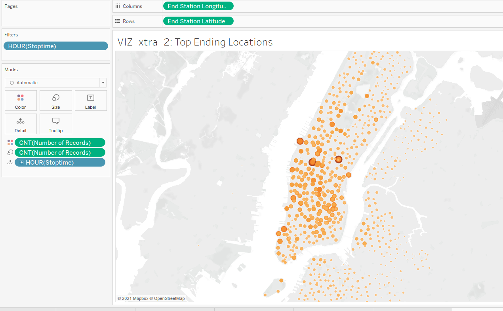

Figure 7. Top ending locations.

The visualization in Figure 7 above is the same as Figure 6, except for ending locations. It's interesting to note that there are a large number of starting locations along the southeastern quadrant of lower Manhattan, but the ending locations are more distributed in locations slightly northwest from there. Somebody will have to move the bikes during the night hours!

###### Average trip duration per bike.

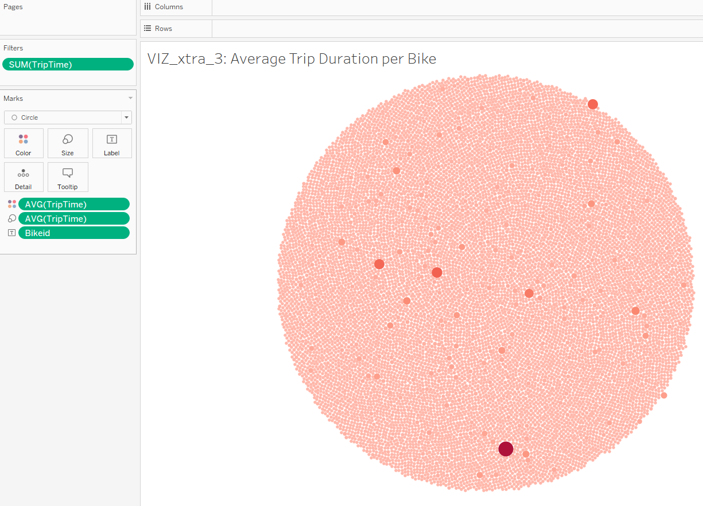

Figure 8. Average trip duration.

The visualization in Figure 8 was done mostly for fun. Since 'Bikeid' is set as a 'Dimension', and the viz type is set to 'Circle', it creates a circular image. The size and color of each circle is determined by the 'AVG(Triptime)' value. Clicking any circle will display a popup with information on that particular bike. Note the larger and redder circles denoting individual bikes which are used more than others.

###### Dashboard.

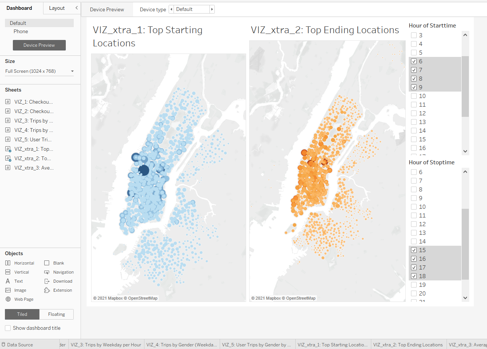

Figure 9. Dashboard.

The visualization in Figure 9 is a Tableau 'dashboard' that combines the data from Figure 6 and Figure 7 above.

#### Deliverable 3, Part 2: Create a Tableau 'Story'

This README.md, and a Tableau 'Story' are required for this deliverable. Note that the Story in Figure 10 has multiple 'Story Points' (i.e. the rectangluar objects along the top). Each story point selects a different worksheet or dashboard which is included in the story.

###### Story.

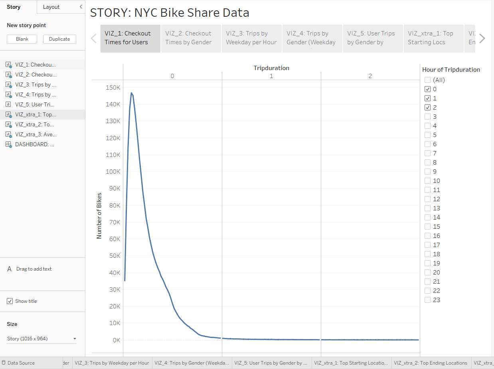

Figure 10. Story.

The Tableau Public 'Story' shown in Figure 10 above is available at:

https://public.tableau.com/app/profile/bruce.jilek/viz/Module14_Deliverables_2_and_3/VIZ_1CheckoutTimesforUsers

Notice that it has grayscale 'boxes' which are called 'Story Points' along the top. Clicking any story point will cause the associated visualization to be displayed like tabs in a web browser. This Tableau Story has 10 story points, which were all described above.

## Summary

We learned the basic features of Tableau. It's a very powerful data analysis and visualization tool. It is also pretty complicated, and there is a lot more to learn. Unfortunately, the whole premise was to evaluate whether a bike share business is feasible in Des Moines, based on an analysis of data for New York City (mostly Manhattan). I don't think there is any comparison between the two cities, and this project didn't provide any hard data for business planning in Des Moines. However, it might have been useful to create two more visualizations, if the data supported it (which it does not):

- Profit per rider.
- Insurance and accident liability risks.

Tableau looks like a useful tool to learn well, and getting a 'Tableau Desktop Specialist', and/or a 'Tableau Desktop Certified Associate' certificate would probably be worthwhile.
